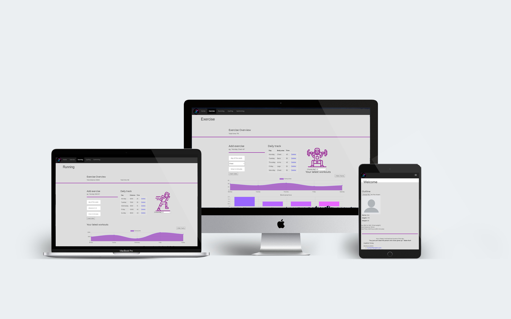

# MyFitTrack - Progressive Web Application
Final project of Web and Mobile Application Development course (MSc in Computer Science and Technology, Department of Applied Informatics, University of Macedonia)

This is a Progressive Web App. Everything is stored in browser's local storage. You can clear everything with the "Delete all records" button on the main page.
After filling the tables with data, you will have to refresh the page for the corresponding chart to appear.

This PWA is live at this link: alexpheeuom.github.io

